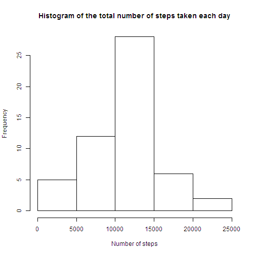

# Reproducible Research: Peer Assessment 1


## Loading and preprocessing the data

```r
#setting Working Directory 
setwd("~/Downloads")
#loading data
data <- read.csv("activity.csv")
```


## What is mean total number of steps taken per day?

```r
stepsPerDate <- aggregate(data$steps,by=list(data$date),FUN=sum)
colnames(stepsPerDate) <- c("date","numSteps") #naming columns
hist(stepsPerDate$numSteps, xlab="Number of steps", main="Histogram of the total number of steps taken each day")
```

 

```r
mean <- mean(stepsPerDate$numSteps,na.rm=TRUE)
median <- median(stepsPerDate$numSteps,na.rm=TRUE)
```

Mean total number of steps taken per day: 1.0766 &times; 10<sup>4</sup>  
Median total number of steps taken per day: 10765

## What is the average daily activity pattern?

```r
stepsPerInterval <- aggregate(data$steps,by=list(data$interval),FUN=mean,na.rm=T)
colnames(stepsPerInterval) <- c("interval","avgSteps") #naming columns
plot(stepsPerInterval$interval,stepsPerInterval$avgSteps,type="l",xlab="Interval",ylab="Average number of steps")
```

 

```r
intMaxStep <- stepsPerInterval[stepsPerInterval$avgSteps==max(stepsPerInterval$avgSteps),"interval"]
```

Interval which contains the maximum number of steps 835

## Imputing missing values

```r
ok <- complete.cases(data)
numMiss <- sum(!ok) #number of missing values

#merging data with stepsPerInterval
new <- merge(data,stepsPerInterval, by.x="interval", by.y="interval")
#replacing NA values in the column "steps" with the mean steps for that interval
new[is.na(new$steps),"steps"] = new[is.na(new$steps),"avgSteps"]
#replace the new data set with only steps, date and interval columns
new <- new[,c("steps","date","interval")]

newStepPerDate <- aggregate(new$steps,by=list(new$date),FUN=sum)
colnames(newStepPerDate) <- c("date","numSteps") #naming columns
hist(newStepPerDate$numSteps,xlab="Number of steps",main="Histogram of the total number of steps taken each day")
```

 

```r
newMean <- mean(newStepPerDate$numSteps,na.rm=TRUE)
newMedian <- median(newStepPerDate$numSteps,na.rm=TRUE)
```


There are 2304 rows with missing values.  
Mean total number of steps taken per day without missing values: 1.0766 &times; 10<sup>4</sup>  
Median total number of steps taken per day without missing values: 1.0766 &times; 10<sup>4</sup>  

## Are there differences in activity patterns between weekdays and weekends?

```r
#converting to Date
new$date = strptime(new$date,format="%Y-%m-%d")
#adding new column "weekday"
new$weekday = "weekday"
#creating filter to check if date is weekend
isWeekend = weekdays(new$date) %in% c("Saturday","Sunday")
new[isWeekend,"weekday"] = "weekend"
#converting to factors
new$weekday = factor(new$weekday)

#calculating the mean by weekday and interval
stepsPerWeekday <- aggregate(new$steps,new[,c("weekday","interval")],FUN=mean)
colnames(stepsPerWeekday) = c("weekday","interval","avgsteps") #naming columns
#setting margins and number of plots in the panel
par(mfcol=c(2,1),mar=c(4,4,0,0))
isWeekend = stepsPerWeekday$weekday == "weekend"
plot(stepsPerWeekday[isWeekend,"interval"],stepsPerWeekday[isWeekend,"avgsteps"],type="l",xlab="",ylab="Number of steps (weekend)")
plot(stepsPerWeekday[!isWeekend,"interval"],stepsPerWeekday[!isWeekend,"avgsteps"],type="l",xlab="Interval",ylab="Number of steps (weekday)")
```

 
